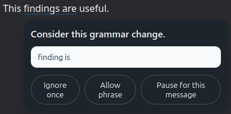

# BYO AI Grammar

`BYO AI Grammar` is a Thunderbird add-on that provides inline grammar suggestions while composing email. You bring your own LLM, as long as it follows the OpenAI API. It leaves Thunderbird's native spelling and personal dictionary behavior in place, and sends the current paragraph while typing, or explicitly selected paragraphs when you click `Check`. In settings, you configure the delay, the model location, and the prompt.
It has been tested with small models.  THey can get lost easily so the prompt is carefully tuned. 

This is an alpha release. I have tested it with Together.ai on smaller open-weights instruction models, and the current default is `google/gemma-3n-E4B-it` because it benchmarks very well on the current grammar test sets while staying cheap. It would be surprising if cost more than a few cents per day.

I have also tested it with LM Studio and the same model ("google/gemma-3-4b"). 

## Thunderbird Add-ons

https://addons.thunderbird.net/en-US/thunderbird/addon/byo-ai-grammar/

## Screenshots

Inline grammar highlights in the compose editor:


Suggestion popup with replacement and quick actions:



## Status

This project is in early development. It currently targets Thunderbird 128. It has only been used on Ubuntu, on stable Thunderbird, with Together.ai as the model provider, and with only a couple of models. The notes about building on other operating systems are best guesses.

## Objective
To provide free, basic English grammar checking as typo/mistake finder. I am a native English speaker so my grammatical errors are the result of poor typing and editing, not lack of English knowledge, so finding errors is more important than knowing how to fix them. 
The tool will report the improvement suggestions of the LLM. I have only tested it on very small LLMs, which provide good but not native-speaker-level grammar support.

## Grammar Policy

This add-on aims to report grammar corrections, not general copy editing.

In particular, by my choice, it does not treat these as grammar corrections on their own:

- sentence-start capitalization only
- sentence-final punctuation only
- smart-quote substitutions only
- semantic rewrites that replace nouns or add descriptive words without a local grammar need

The extension prefers small, localised grammatical fixes such as agreement, articles, missing or repeated words, and contextual homophone, contraction, or function-word corrections.

Context-dependent word-form mistakes such as `its` vs `it's` stay in scope here because they need grammatical interpretation, not just a dictionary lookup.

## Features

- Grammar-only suggestions layered on top of Thunderbird compose windows.
- It doesn't try to replace Thunderbird spelling; it focuses on grammar plus context-dependent word-form errors such as `its` vs `it's`.
- Current-paragraph-only checking while you type
- User-configured OpenAI-compatible server URL, model, and saved API key
- Custom prompt support with a bounded prompt budget, but the system prompt is pretty good.
- Grammar allowlist support for approved phrases and project-specific exceptions (currently limited to 50 entries)
- Corrected-text plus local diffing so inline suggestions do not depend on model-provided offsets
- Request lifecycle guards that ignore stale responses while you keep typing
- Compose-action `Check` mode for queueing selected paragraphs through the normal per-paragraph grammar suggestion flow
- Optional debug logging for Browser Console and Debug Add-ons troubleshooting
- Per-message pause control
- Undo has worked the few times I've tried it so far, but I wouldn't bet on it.

### Things to watch
- It can ignore pasted content, but you can select the text and click the icon, or make a trivial change.
  
  


## Install In Thunderbird

### Temporary Developer Install

Use this while actively developing:

1. Open Thunderbird.
2. Open the Add-ons Manager.
3. Open `Debug Add-ons`.
4. Click `Load Temporary Add-on`.
5. Select `dist/manifest.json`.

This install disappears when Thunderbird restarts.

### Local Installable Add-On

Use this when you want a normal locally installed extension file:

1. Run `npm run package`.
2. Open Thunderbird.
3. Open the Add-ons Manager.
4. Open the gear menu.
5. Choose `Install Add-on From File...`.
6. Select the generated `.xpi` file.

The `.xpi` is the correct file for a local install. Do not choose `manifest.json` for this path.

## Configure The Add-On

After installation, open the add-on settings and configure:

- OpenAI-compatible server URL
- saved API key
- model string
- debug logging toggle
- custom grammar prompt
- grammar allowlist entries

Recommended Together.ai defaults:

- Server URL: `https://api.together.xyz/v1`
- Model: `google/gemma-3n-E4B-it`

## Connecting To LLMs

### Hosted OpenAI-Compatible Providers

Use the provider's OpenAI-compatible base URL, your model string, and your API key.

For Together.ai, the tested configuration is:

- Server URL: `https://api.together.xyz/v1`
- Model: `google/gemma-3n-E4B-it`

### Local LLMs (LM Studio)

`BYO AI Grammar` has been tested with LM Studio using its local OpenAI-compatible server.

Tested LM Studio configuration:

- Server URL: `http://127.0.0.1:1234/v1`
- Model: `google/gemma-3-4b`
- API key: leave blank

In LM Studio Server Settings:

- `Require Authentication` should be `Off` (this is the default)
- `Enable CORS` should be `On` (this is not the default)

If `Enable CORS` is off, Thunderbird will fail before the real request is sent because the browser preflight request is blocked.

## API Key Storage And Security

The add-on stores the API key in Thunderbird extension local storage inside your Thunderbird profile.

Important limitations:

- This is convenient for local use.
- It is not protected by an OS keychain or hardware-backed secret store.
- Anyone with access to your local Thunderbird profile may be able to recover it.

If you need stronger secrets handling, this project would need a different architecture such as a local proxy or native helper.

## Privacy Policy

Only the paragraph under your cursor is sent while typing, unless you manually select paragraphs and click `Check`.

The extension does not use analytics or telemetry.

If debug logging is enabled, inspect the Browser Console or the add-on entry in Debug Add-ons to review request ids, stale-response drops, and service errors. The default is off.

## Release Packaging With GitHub Actions

This repository includes a manual GitHub Actions workflow that builds the `.xpi` on demand.

To use it:


## What You Need to build

- Thunderbird 128 or newer
- Git
- Node.js 24 or newer
- npm 11 or newer

Check your versions:

```bash
node --version
npm --version
```

## Clone The Project

Linux and macOS:

```bash
git clone https://github.com/timrichardson/byo_ai_grammar.git
cd byo_ai_grammar
```

Windows PowerShell:

```powershell
git clone https://github.com/timrichardson/byo_ai_grammar.git
Set-Location byo_ai_grammar
```

## Install Dependencies

All platforms:

```bash
npm install
```

## Build The Extension

Standard build:

```bash
npm run build
```

Type-check the code:

```bash
npm run typecheck
```

Create an installable `.xpi` package:

```bash
npm run package
```

That produces a file like:

```text
byo_ai_grammar-<version>.xpi
```
1. Open the repository on GitHub.
2. Open the `Actions` tab.
3. Choose `Build Release XPI`.
4. Click `Run workflow`.
5. Optionally provide a tag name if you want the `.xpi` attached to a GitHub Release.

The workflow always uploads the `.xpi` as a workflow artifact. If you choose release upload, it also attaches the same file to the selected GitHub Release.

## Development Notes

- `npm run watch` rebuilds while you edit
- `npm run build` writes runtime files into `dist/`
- `npm run test` runs focused unit tests for prompt, validation, diffing, and request helpers
- `npm run replay:request -- --base-url https://api.together.xyz/v1 --model google/gemma-3n-E4B-it --active-text "These updates is ready to send."` replays a grammar request outside Thunderbird using `BYO_AI_GRAMMAR_API_KEY`, `TOGETHER_API_KEY`, or `OPENAI_API_KEY` and logs request timing
- `npm run benchmark:models -- --base-url https://api.together.xyz/v1 --runs 2` benchmarks a default set of smaller Together chat models for contract reliability and latency using the same grammar prompt and the same supported env vars
- `npm run package` creates a Thunderbird-installable `.xpi`
- `npm run release:prepare -- --version 0.4.31` verifies a clean git tree, bumps the release version, commits it, builds a new `.xpi`, keeps only the newest three `.xpi` files, and creates a source `.zip` archive for add-on submission
- `package.json` and `public/manifest.json` should stay aligned on release versions

## Contributing

See `CONTRIBUTING.md` for setup, coding standards, and contribution workflow.

## Versioning

This project uses Semantic Versioning (`MAJOR.MINOR.PATCH`).

- `0.y.z` is used during early development
- `MAJOR` increments for incompatible public changes
- `MINOR` increments for new backwards-compatible features
- `PATCH` increments for backwards-compatible fixes

## License

This project is licensed under the Mozilla Public License 2.0. See `LICENSE`.


# Build

## What You Need to build

- Thunderbird 128 or newer
- Git
- Node.js 24 or newer
- npm 11 or newer

Check your versions:

```bash
node --version
npm --version
```

## Clone The Project

Linux and macOS:

```bash
git clone https://github.com/timrichardson/byo_ai_grammar.git
cd byo_ai_grammar
```

Windows PowerShell:

```powershell
git clone https://github.com/timrichardson/byo_ai_grammar.git
Set-Location byo_ai_grammar
```

## Install Dependencies

All platforms:

```bash
npm install
```

## Build The Extension

Standard build:

```bash
npm run build
```

Type-check the code:

```bash
npm run typecheck
```

Create an installable `.xpi` package:

```bash
npm run package
```

That produces a file like:

```text
byo_ai_grammar-<version>.xpi
```
